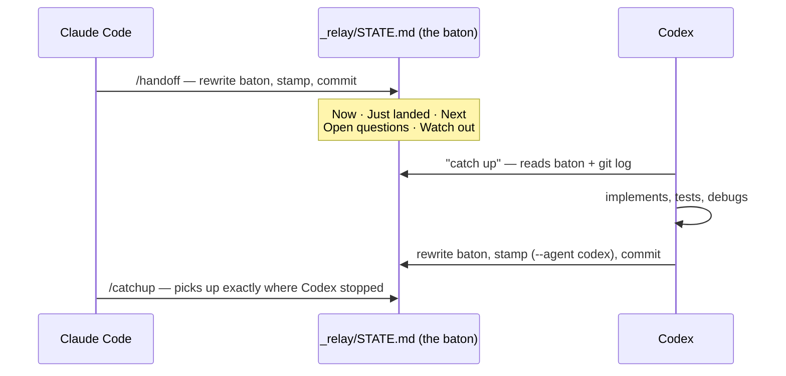
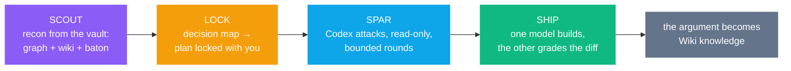

<div align="center">



<br/><br/>

**Clone a brain, not a boilerplate.**

Cortex is a plug-and-play project OS: an Obsidian **LLM Wiki**, **Graphify code graphs**,
a **video-watching pipeline**, and a **relay** that lets **Claude Code and Codex work the
same project — alternating freely, with zero copy-paste.**

<br/>

[](LICENSE)
[](CLAUDE.md)
[](AGENTS.md)
[](https://obsidian.md)
[](scripts/)

<br/>

[**Get started in 5 minutes →**](GETTING-STARTED.md) ·
[Operating guide](VAULT-GUIDE.md) ·
[The relay protocol](_relay/PROTOCOL.md) ·
[Every command](Schema/command-reference.md)

</div>

---

## Why this exists

AI coding agents are brilliant and amnesiac. Every session starts from zero: you re-explain
the project, re-paste the context, re-open the same twenty files. Switch from Claude Code to
Codex and it's worse — two brilliant agents, two separate amnesias, and you're the
copy-paste middleware between them.

Cortex fixes the memory problem at the repository level. **The repo *is* the brain.**
Everything an agent needs to be instantly useful — knowledge, code understanding, session
state — lives in files, is validated by deterministic tooling, and travels with `git`.

| Memory | What it holds | Where it lives |
|---|---|---|
| 🧠 **Knowledge** | every meeting, doc, video, and decision — compiled into short, linked, *source-traceable* notes | `Wiki/` + `Raw/Sources/` |
| 🕸️ **Code understanding** | a queryable knowledge graph per repo (communities, god nodes, impact analysis) | `graphify/` |
| 🏃 **Session state** | the baton: what just landed, what's next, what to watch out for | `_relay/STATE.md` |

Open the folder in **Obsidian** and the whole brain becomes a navigable constellation —
notes, code nodes, and sources, all one graph.

---

## The relay — use both agents like one agent

Claude Code plans beautifully. Codex grinds through execution and debugging. Cortex lets
you use each for what it's best at, **on the same project, alternately, without
re-explaining anything**:



- Both agents read the same rules (`CLAUDE.md` for Claude, `AGENTS.md` for Codex) and
  write the same baton.
- `python scripts/relay_tool.py status` detects a **stale baton** (commits after the last
  handoff) so nobody trusts old state.
- Both agents' chat transcripts are archived locally (`python scripts/import_chats.py`)
  — searchable memory, secrets redacted, never committed.

> No copy-paste. No "let me summarize the conversation so far." Open the other tool and say
> *"catch up."*

---

## Sparring — make the models argue before you build

The relay is the async mode. `/spar` is the sync mode: both models in **one session**,
where the rival attacks the driver's work — because *whoever made the thing never grades
the thing*. For auth, schemas, migrations, payments, greenfield architecture — anything
expensive to get wrong.



What makes Cortex's version different from a standalone review loop:

- **Recon is nearly free** — the scout phase reads the code graph and wiki catalog
  instead of sweeping the repo, and every assumption cites its source note.
- **The loop is resumable state, not chat history** — rounds, verdicts, and the
  reviewer's thread id live in `_relay/spar/` (`scripts/spar_tool.py`); any later
  session — either agent — picks up an interrupted spar.
- **Findings are severity-tagged and arbitrated** — every `[FATAL]`/`[MAJOR]` gets an
  accept-or-rebut in the log; a round cap turns into an honest deadlock report, never a
  fake "approved".
- **Builds are graded both directions** — Codex builds (sandboxed `workspace-write`) and
  Claude reads the whole diff + runs the proof; Claude builds and a fresh read-only Codex
  session cross-inspects. You gate the diff either way.
- **The argument becomes knowledge** — finished spars are archived, captured as a Raw
  source, and compiled into wiki notes. Next quarter's "why is it built this way?" is a
  catalog search, not archaeology.

Works in reverse, too — a Codex-driven session can spar with headless Claude as the
read-only critic. Cross-model mechanics hardened by
[claudex-loop](https://github.com/chaseai-yt/claudex-loop) (MIT); see
[THIRD-PARTY-NOTICES.md](THIRD-PARTY-NOTICES.md).

---

## The layered memory — answers stay fast, cheap, and cited

Every question routes through the cheapest layer that can answer it:


No repo sweeps. No transcript re-reads. Claims trace back to sources, and a linter
enforces it: every compiled note must name the raw files that support it
(`sources` / `source_count`), tags must match folders, and a **maintenance gate**
(`doctor → build → lint → source-lint → audit`) blocks bad commits — including secrets
and machine-local paths.

---

## It watches videos, too

Point it at a meeting recording, a screen capture, **or a YouTube/TikTok URL**:

```
/video standup-2026-03-14.mkv
/video https://youtube.com/watch?v=...   ← reference videos for design/research
```

Under the hood: [`crv`](https://pypi.org/project/claude-real-video/) extracts scene-aware
deduplicated keyframes + a Whisper transcript, the agent **correlates what's shown with
what's said** frame-by-frame, redacts secrets, and compiles the result into linked notes
with curated screenshots. Your standups become queryable knowledge.

---

## The war-room — a plan that watches videos back

Plans die the week after kickoff. Cortex keeps a **living plan** (`Plan/` — roadmap,
phases with exit criteria, a tool-adoption ledger) and runs every new input *against* it:

```
/roadmap My Product          ← build the plan: vision → phases → exit criteria
/intel https://youtube.com/...   ← "should we use anything from this?"
```

`/intel` loads the **plan digest first**, then watches the video, then ranks every
technique and tool in it — phase fit, impact, effort, confidence → **ADOPT / TRIAL /
WATCH / SKIP** — and delivers one honest verdict: `INCORPORATE`, `WATCHLIST`, or `PASS`
("nothing here beats the plan" is a win, not a failure). You gate what gets in. Adopted
items land in the phase files **with provenance back to the brief**; tools get verified
official sources, per-tool confirmed installs, and a `candidate → trialing → adopted`
ledger in `TOOLBOX.md`. Six months later, "why did we do it this way?" has a paper trail.

---

## 60-second start

```bash
git clone https://github.com/gavishap/cortex.git my-project
cd my-project
claude        # or: codex
```

**New project?**

```
/setup My Product Name
```

**Existing project?** Drop your repos / recordings / docs into the folder, then:

```
/import
```

Then live the loop:

```
/catchup   →   work: ask · ingest · build · design   →   /save
```

Full walkthrough (+ optional tooling like `graphify`, `crv`, `ffmpeg`):
[GETTING-STARTED.md](GETTING-STARTED.md)

---

## What's in the box

```
├─ Wiki/            compiled knowledge — topics · concepts · entities · projects · logs
├─ Raw/Sources/     captured material, verbatim, source-of-truth for every claim
├─ graphify/        committed code-graph snapshots per tracked repo
├─ Plan/            the war-room (via /roadmap): phased roadmap · intel briefs · toolbox
├─ _relay/          the baton (STATE.md) + handoff history + sparring loop state
├─ Schema/          frontmatter contracts · naming · lint rules · command reference
├─ _templates/      six note templates (source/topic/concept/entity/project/log)
├─ scripts/         deterministic tooling — python stdlib only, no dependencies
├─ .claude/
│  ├─ skills/       21 skills, ready on clone (see below)
│  └─ commands/     15 slash commands (/setup /import /catchup /save /spar /intel ...)
├─ CLAUDE.md        Claude Code wiring        AGENTS.md   Codex + any-agent rules
└─ VAULT-GUIDE.md   the full operating guide
```

### The skill arsenal

| Ready on clone (vendored) | What it does |
|---|---|
| `graphify` | any folder / repo / paper / video → queryable knowledge graph (`query` · `explain` · `path` · `affected`) |
| `video-ingest` | recordings & video URLs → transcript ⇄ frames, correlated, compiled |
| `import-project` | adopt an existing codebase + raw files into the vault |
| `relay` | the Claude ⇄ Codex baton pass (async) |
| `sparring` | the Claude ⇄ Codex argument (sync): adversarial plan review + cross-graded builds |
| `war-room` | the living plan (`Plan/`): phased roadmap + plan-aware video triage + tool adoption ledger |
| `github-pr-api` | GitHub PRs from machines with no `gh` CLI (credential-store token + REST) |
| `project-context-query` | the 3-layer answer engine |
| `llm-wiki-ingest / query / lint / maintain` | the LLM Wiki core loops |
| `taste` | anti-slop frontend design ([Leonxlnx/taste-skill](https://github.com/Leonxlnx/taste-skill), MIT) |
| `ui-ux-pro-max` | searchable design intelligence: 79 styles · 192 palettes · 74 font pairs · 119 UX rules ([nextlevelbuilder](https://github.com/nextlevelbuilder/ui-ux-pro-max-skill), MIT) |
| `obsidian-markdown / bases / canvas / cli / defuddle` | first-class Obsidian editing ([kepano/obsidian-skills](https://github.com/kepano/obsidian-skills), MIT) |
| `humanizer` + `stakeholder-update-writing` | outward-facing prose that doesn't read like a bot |

| One command away | How |
|---|---|
| **impeccable** — 23 design commands (`polish`, `animate`, `critique`, …) | `/design-setup` |
| **Anthropic document skills** — Word · PDF · PowerPoint · Excel deliverables | `/docs-setup` |

### The commands

| Command | Does |
|---|---|
| `/setup` · `/import` | initialize a new project · adopt an existing one |
| `/catchup` · `/save` · `/handoff` | the daily loop + the agent switch |
| `/spar` | cross-model adversarial review before high-stakes builds |
| `/roadmap` · `/intel` | the living plan · triage a video/meeting against it |
| `/ingest` · `/video` | any source → knowledge · any recording/URL → knowledge |
| `/wiki` · `/graph` · `/gate` | layered answers · code graphs · the quality gate |
| `/design-setup` · `/docs-setup` | design stack · document stack |

---

## FAQ

**Do I need both agents?** No — everything works with just Claude Code *or* just Codex.
The relay simply means you never lose state if you add the second one.

**Do I need Obsidian?** No, but you want it: the vault is plain Markdown that happens to
render as a beautiful navigable graph.

**What are the actual dependencies?** Python 3.9+ and git. That's it — every script is
standard-library only. `graphify` (code graphs), `crv` + `ffmpeg` (video), Node
(web clipping), and the Codex CLI (sparring) are optional — each unlocks a feature.
`python scripts/setup_vault.py --check` shows what's missing and
`python scripts/setup_vault.py --install` installs what it can for you.

**Is my data safe in here?** The vault ships empty (one self-documenting demo you can
prune with one command). The audit gate blocks secrets and machine-local paths from ever
being committed, repos you import stay gitignored, and chat archives never leave your
machine.

**Where did this design come from?** It's the extraction of a production consulting
system — battle-tested on a real engagement (multi-repo codebase, recorded meetings,
diagrams, evolving requirements), then scrubbed to a clean template.

---

<div align="center">

Built on the shoulders of [kepano/obsidian-skills](https://github.com/kepano/obsidian-skills),
[Leonxlnx/taste-skill](https://github.com/Leonxlnx/taste-skill),
[nextlevelbuilder/ui-ux-pro-max-skill](https://github.com/nextlevelbuilder/ui-ux-pro-max-skill),
[graphifyy](https://pypi.org/project/graphifyy/) and
[claude-real-video](https://pypi.org/project/claude-real-video/) —
see [THIRD-PARTY-NOTICES.md](THIRD-PARTY-NOTICES.md).

**MIT licensed. Clone it, gut it, ship with it.**

⭐ if your projects deserve a brain.

</div>
