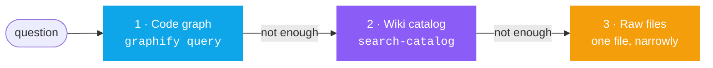
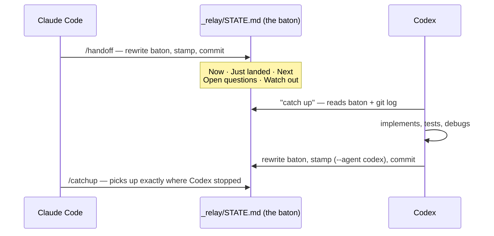

<div align="center">



<br/><br/>

**Omnia** — Latin for *all things*. **Vault** — where your project keeps them.

Omnia Vault is an all-in-one project brain you clone: an Obsidian **LLM wiki**, **code
knowledge graphs**, a **living plan that triages every new video and meeting against
itself**, a **20+ skill toolkit**, and a **relay** that lets Claude Code and Codex work
the same project with zero copy-paste. Memory, planning, tools, agents — one repo.

<br/>

[](LICENSE)
[](CLAUDE.md)
[](AGENTS.md)
[](https://obsidian.md)
[](.claude/skills/war-room/SKILL.md)
[](scripts/)

<br/>

[**Get started in 5 minutes →**](GETTING-STARTED.md) ·
[Operating guide](VAULT-GUIDE.md) ·
[The relay protocol](_relay/PROTOCOL.md) ·
[Every command](Schema/command-reference.md)

</div>

---

## Why this exists

Three things quietly kill AI-assisted projects:

1. **Agents are amnesiac.** Every session starts from zero — you re-explain the project,
   re-paste the context, re-open the same twenty files. Use both Claude Code *and* Codex
   and it's worse: two brilliant tools, two separate amnesias, and you're the copy-paste
   middleware between them.
2. **Plans die the week after kickoff.** New information keeps arriving — a meeting, a
   YouTube technique, a shiny tool — and it either gets ignored or bolted on with no
   judgment, until the "plan" describes a project that no longer exists.
3. **Knowledge evaporates.** The decision from that call three weeks ago? The reason you
   rejected that framework? Gone with the chat scrollback.

Omnia Vault fixes all three at the repository level. **The repo *is* the operation** —
everything an agent needs to be instantly useful lives in files, validated by
deterministic tooling, traveling with `git`:

| Layer | What it holds | Where it lives |
|---|---|---|
| 🧠 **Memory** | every meeting, doc, video, and decision — compiled into short, linked, *source-traceable* notes | `Wiki/` + `Raw/Sources/` |
| 🕸️ **Code understanding** | a queryable knowledge graph per repo (communities, god nodes, impact analysis) | `graphify/` |
| 🗺️ **The plan** | a phased roadmap with exit criteria, intel briefs, and a tool-adoption ledger | `Plan/` |
| 🏃 **Session state** | the baton: what just landed, what's next, what to watch out for | `_relay/STATE.md` |

Open the folder in **Obsidian** and the whole brain becomes a navigable constellation —
notes, code nodes, plans, and sources, all one graph.

---

## The war-room — feed it videos, and the plan evolves

`/roadmap` builds the plan the right way: vision → measurable success criteria → phases
with **exit criteria** — locked with you, not guessed. Then the part most systems don't
have: **the plan metabolizes new information.**

```
/intel https://youtube.com/watch?v=...     ← "here's a new technique — worth anything to us?"
/intel standup-recording.mkv               ← meetings feed the same loop
```

Every `/intel` runs the same discipline:

1. **Plan digest first, video second** — the triage loads the roadmap, the active phase's
   open deliverables, and the adopted toolbox *before* watching a single frame. The
   answer is about *your project*, never just a video summary.
2. **Watch it properly** — scene-aware keyframes + Whisper transcript, correlated
   frame-by-frame; the full capture lands in `Raw/Sources/` for permanent citation.
3. **Rank every item against the plan** — phase fit / impact / effort / confidence →
   **ADOPT · TRIAL · WATCH · SKIP**, ending in one honest verdict:
   `INCORPORATE`, `WATCHLIST`, or `PASS`. ("Nothing here beats the plan" is a win — and
   the logged brief stops the same video from being re-litigated next month.)
4. **You gate what gets in.** Adopted items land in the phase files **with provenance
   back to the brief**; phases rebalance only when argued and approved.
5. **Tools get adopted like adults** — official source verified (video links are treated
   as untrusted), per-tool confirmed installs, `candidate → trialing → adopted` tracked
   in `TOOLBOX.md` with the *why* kept even for rejections.

Six months later, "why is the project shaped like this?" has a paper trail: brief →
phase edit → commit.

---

## The layered memory — answers stay fast, cheap, and cited

Every question routes through the cheapest layer that can answer it:



No repo sweeps. No transcript re-reads. Claims trace back to sources, and the linter
keeps it honest: source links must point at real files with accurate counts, tags must
match folders, and sourceless notes get flagged. The **maintenance gate**
(`doctor → build → lint → source-lint → audit`) runs before every commit — the audit
is a best-effort text scan of the working tree for secrets and machine-local paths,
and one command (`sh scripts/install_hooks.sh`) wires the full gate into a pre-commit
hook. Recordings and
reference videos enter through the same door: `/video <file-or-URL>` turns anything
crv can watch (local files, YouTube, TikTok, Instagram) into transcript ⇄ keyframe
knowledge with curated screenshots.

---

## Two agents, one project — the relay and the sparring ring

Claude Code plans beautifully. Codex grinds through execution. Omnia Vault lets you use
each for what it's best at — **asynchronously** (the relay) and **synchronously**
(sparring).

**The relay** — switch agents anytime, with zero copy-paste:



Both agents read the same rules (`CLAUDE.md` / `AGENTS.md`), write the same baton, and
get their chat transcripts archived locally (`import_chats.py` — searchable, redacted,
never committed). A stale-baton detector warns when commits pile up after the last
handoff without a fresh baton pass.

**Sparring** (`/spar`) — for high-stakes builds, make the models argue *before* the
code exists: Codex attacks the locked plan in bounded **read-only** rounds
(severity-tagged findings, accept-or-rebut arbitration, honest deadlocks), then one
model builds and the other grades the diff — *whoever made the thing never grades the
thing*. The whole argument is resumable state in `_relay/spar/` and gets compiled into
the wiki afterward. Works in reverse too (Codex drives, headless Claude reviews).

**The council** (`/council`) — for expensive-if-wrong *decisions* (pricing, pivots,
architecture direction), convene five blind seats **split across both models**: a
Codex Skeptic, a Claude Rebuilder, a Claude Maximalist, a Codex Operator — and an
Outsider seat that runs from an **empty directory**, so it judges your idea knowing
literally nothing about you (the curse of knowledge, cured by a sandbox). Opinions are
anonymized, each bench blind-reviews the mixed set, and the chair rules — dissent
preserved in writing, record kept in `_relay/council/`. Sparring is depth on one plan;
the council is breadth before you lock one.

---

## 60-second start

```bash
git clone https://github.com/gavishap/omnia-vault.git my-project
cd my-project
claude        # or: codex
```

**New project?**

```
/setup My Product Name
/roadmap My Product Name
```

**Existing project?** Drop your repos / recordings / docs into the folder, then:

```
/import
```

Then live the loop:

```
/catchup  →  work: ask · ingest · /intel new videos · build · /spar the risky parts  →  /save
```

> Slash commands are Claude Code's interface. In **Codex**, just say it in words —
> *"catch up"*, *"triage this video against the plan"*, *"save"* — `AGENTS.md` wires the
> same workflows and scripts for any agent that reads it.

Missing tooling? `python scripts/setup_vault.py --check` shows what's optional and
`--install` installs what it can (pip/npm/winget/brew) — the core needs only Python
and git. Full walkthrough: [GETTING-STARTED.md](GETTING-STARTED.md)

---

## What's in the box

```
├─ Wiki/            compiled knowledge — topics · concepts · entities · projects · logs
├─ Raw/Sources/     captured material, verbatim, source-of-truth for every claim
├─ Plan/            the war-room (via /roadmap): phased roadmap · intel briefs · toolbox
├─ graphify/        committed code-graph snapshots per tracked repo
├─ _relay/          the baton (STATE.md) + handoff history + sparring loop state
├─ Schema/          frontmatter contracts · naming · lint rules · command reference
├─ _templates/      six note templates (source/topic/concept/entity/project/log)
├─ scripts/         stdlib-only python tooling — zero dependencies to install
├─ .claude/
│  ├─ skills/       22 skills, ready on clone (see below)
│  └─ commands/     16 slash commands (/setup /import /catchup /save /spar /intel ...)
├─ CLAUDE.md        Claude Code wiring        AGENTS.md   Codex + any-agent rules
└─ VAULT-GUIDE.md   the full operating guide
```

### The skill arsenal

| Ready on clone (vendored) | What it does |
|---|---|
| `graphify` | any folder / repo / paper / video → queryable knowledge graph (`query` · `explain` · `path` · `affected`) |
| `war-room` | the living plan (`Plan/`): phased roadmap + plan-aware video triage + tool adoption ledger |
| `video-ingest` | recordings & video URLs → transcript ⇄ frames, correlated, compiled |
| `import-project` | adopt an existing codebase + raw files into the vault |
| `relay` | the Claude ⇄ Codex baton pass (async) |
| `sparring` | the Claude ⇄ Codex argument (sync): adversarial plan review + cross-graded builds |
| `council` | five-seat decision panel split across both models, blind opinions + cross-bench review |
| `project-context-query` | the 3-layer answer engine |
| `llm-wiki-ingest / llm-wiki-query / llm-wiki-lint / llm-wiki-maintain` | the LLM Wiki core loops |
| `taste` | anti-slop frontend design ([Leonxlnx/taste-skill](https://github.com/Leonxlnx/taste-skill), MIT) |
| `ui-ux-pro-max` | searchable design intelligence: 79 styles · 192 palettes · 74 font pairs · 119 UX rules ([nextlevelbuilder](https://github.com/nextlevelbuilder/ui-ux-pro-max-skill), MIT) |
| `obsidian-markdown / obsidian-bases / json-canvas / obsidian-cli / defuddle` | first-class Obsidian editing ([kepano/obsidian-skills](https://github.com/kepano/obsidian-skills), MIT) |
| `humanizer` + `stakeholder-update-writing` | outward-facing prose that doesn't read like a bot |
| `github-pr-api` | GitHub PRs from machines with no `gh` CLI (credential-store token + REST) |

| Guided install (a command that walks you through the plugin setup) | How |
|---|---|
| **impeccable** — 23 design commands (`polish`, `animate`, `critique`, …) | `/design-setup` → two `/plugin` commands |
| **Anthropic document skills** — Word · PDF · PowerPoint · Excel deliverables | `/docs-setup` → two `/plugin` commands |

### The commands

| Command | Does |
|---|---|
| `/setup` · `/import` | initialize a new project · adopt an existing one |
| `/roadmap` · `/intel` | build the living plan · triage a video/meeting against it |
| `/catchup` · `/save` · `/handoff` | the daily loop + the agent switch |
| `/spar` · `/council` | cross-model adversarial review · five-seat cross-model decision panel |
| `/ingest` · `/video` | any source → knowledge · any recording/URL → knowledge |
| `/wiki` · `/graph` · `/gate` | layered answers · code graphs · the quality gate |
| `/design-setup` · `/docs-setup` | design stack · document stack |

---

## FAQ

**Do I need both agents?** No — all core vault workflows (wiki, graphs, plan, relay,
video ingest) work with just Claude Code *or* just Codex via `AGENTS.md`. The relay
simply means you never lose state if you add the second one; sparring needs both
because arguing with yourself is cheating; and the `/design-setup` / `/docs-setup`
plugin extras are Claude Code-specific.

**Do I need Obsidian?** No, but you want it: the vault is plain Markdown that happens to
render as a beautiful navigable graph.

**What are the actual dependencies?** Python 3.9+ and git. That's it — every script is
standard-library only. `graphify` (code graphs), `crv` + `ffmpeg` (video), Node
(web clipping), and the Codex CLI (sparring) are optional — each unlocks a feature.
`python scripts/setup_vault.py --check` shows what's missing and
`python scripts/setup_vault.py --install` installs what it can for you.

**Can it really install tools it finds in videos?** Yes, with guardrails: the official
source gets verified first (video links are untrusted input), you confirm each tool
individually, and every install is recorded in `Plan/TOOLBOX.md` with provenance.

**Is my data safe in here?** The vault ships empty (one self-documenting demo you can
prune with `python scripts/setup_vault.py --prune-demo`). The audit gate — a best-effort
scan wired into the pre-commit hook — catches secrets and machine-local paths before
they land, repos you import stay gitignored, and chat archives never leave your
machine.

**Where did this design come from?** It's the extraction of a production consulting
system — battle-tested on a real engagement (multi-repo codebase, recorded meetings,
diagrams, evolving requirements), then scrubbed to a clean template.

---

<div align="center">

Built on the shoulders of [kepano/obsidian-skills](https://github.com/kepano/obsidian-skills),
[Leonxlnx/taste-skill](https://github.com/Leonxlnx/taste-skill),
[nextlevelbuilder/ui-ux-pro-max-skill](https://github.com/nextlevelbuilder/ui-ux-pro-max-skill),
[graphifyy](https://pypi.org/project/graphifyy/),
[claude-real-video](https://pypi.org/project/claude-real-video/) and the
cross-model mechanics of [claudex-loop](https://github.com/chaseai-yt/claudex-loop) —
see [THIRD-PARTY-NOTICES.md](THIRD-PARTY-NOTICES.md).

**MIT licensed. Clone it, gut it, ship with it.**

⭐ *Omnia* — because your project deserves all of it.

</div>
